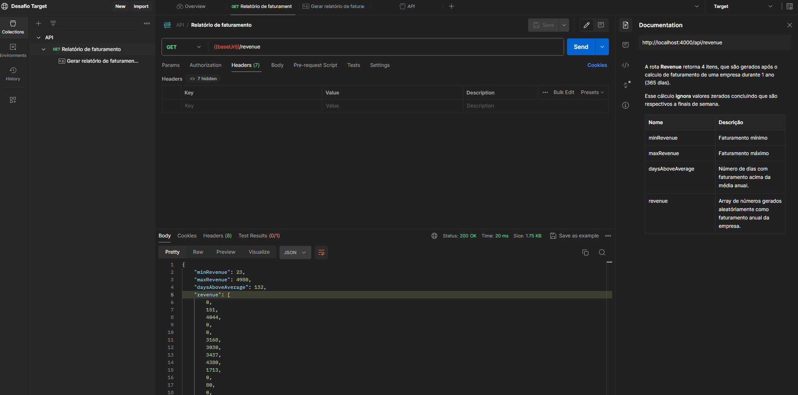
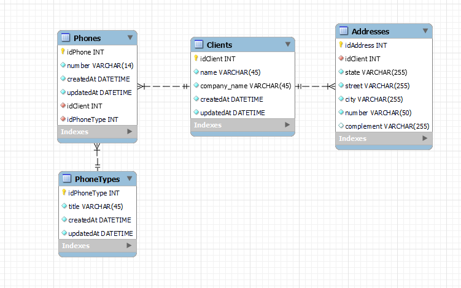
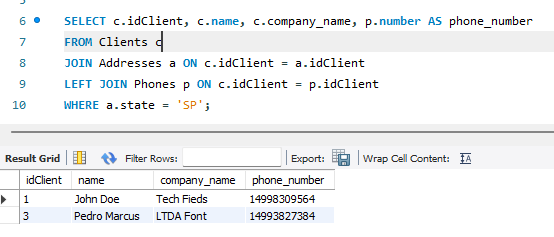
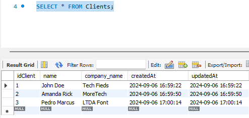
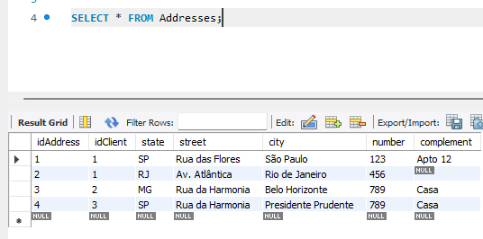

# Desafio Vaga Target :)
### API com geração de relatório anual de uma empresa.


#### Exercícios

- Exercício 1: Resultado 77
``` typescript
const i: number = 12;
let sum: number = 0;
let k: number = 1;

while(k < i) {
	k += 1;
	sum += k;
}

console.log('Resultado exercício 1:', sum);
```
<br></br>
<br></br>
- Exercício 2

	a) 9
	- Sequência numérica onde os números resultantes são ímpares. Acréscimo do antecessor ao 2.

	b) 128
	- Progressão geométrica onde existe uma razão fixa (Q) que a partir do primeiro termo, os termos são calculados em razão de Q vezes seu antecessor.

	c) 49
	- Sequência numérica de quadrados perfeitos: 0x0, 1x1, 2x2, 3x3, 4x4, 5x5, 6x6...

	d) 100
	- Progressão aritmética onde a razão (Q) da sequência é: 8 unidades somadas a diferença entre valor A e B.
	No caso, de 36 a 64 +28 e a soma ao valor atual será 28+8 = 36. Totalizando 64+36 = 100.

	e) 13
	- Sequência de Fibonacci se inicia com 0 e 1, e sua subsequência é a soma dos dois números anteriores. Nesse caso 8+5.

	f) 200
	- Não segue sequência lógica matemática e sim do português. Todos iniciando com a letra "D".

<br></br>
<br></br>

- Exercício 3
### Para rodar o projeto rode `yarn install` e após isso `yarn build && yarn run`
[Documentação Postman](undefined/workspace/desafio-target/collection/23505128-b60130cf-84c7-45c7-b339-a3f51d175716?action=share&creator=23505128&active-environment=23505128-6f5e4977-b4eb-40a3-ad3d-40c0c5a8b352)



<br></br>
<br></br>

- Exercício 4 (Banco de dados)
	#### Para normalização e garantia de consistência dos dados, a modelagem criada foi com banco de dados relacional. Esse modelo permite a criação das chaves para manter relacionamentos e reduzir redundâncias. É possível visualizar quais campos são chaves estrangeiras pelos ícones no print abaixo.

```diff
- Ícones em vermelho na representação mostram FK´s;

! Ícones em amarelo (chave) representam PK´s.
```



#### - Faça uma busca utilizando comando SQL que traga o código, a razão social e o(s) telefone(s) de todos os clientes do estado de São Paulo (código “SP”);

##### A busca utilizada foi a seguinte (company_name seria razão social):
``` sql
SELECT c.idClient, c.name, c.company_name, p.number AS phone_number
FROM Clients c
JOIN Addresses a ON c.idClient = a.idClient
LEFT JOIN Phones p ON c.idClient = p.idClient
WHERE a.state = 'SP';
```

	
```diff
+ Caso queira acessar o dump desse banco, acesse o arquivo na raiz desse projeto chamado client_dump.sql
```

#### Prints do resultado


#### Tabela Cliente e Tabela Endereços





